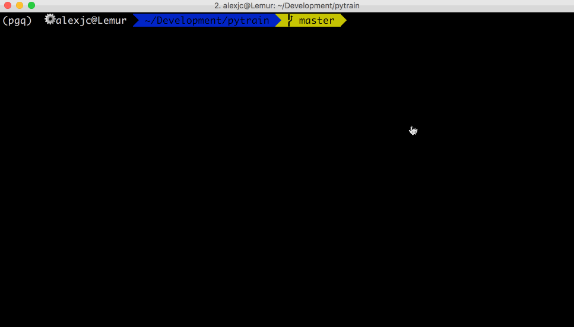

.. image:: https://img.shields.io/badge/python-3.6%2B-blue

**What It Does.** Like ``pytest`` supports you in writing better Python code through automated testing, ``pytrain`` helps you build differentiable programs by making it easy to create tasks and use them to optimize your programs.

**How It Works.** You write differentiable components (e.g. using PyTorch) along with tasks they are expected to handle, and ``pytrain`` will optimize all the parameters involved and save them to disk as an automated process.

Installation
============

.. code:: bash

    # Create a base environment
    conda create -n myenv python=3.6
    conda install pytorch -c pytorch

    # Either install latest release 0.0.x, see GitHub for latest version number:
    pip install https://github.com/alexjc/pytrain/releases/download/v0.0.x/pytrain-0.0.x.tar.gz

    # Or clone the repository online:
    git clone https://github.com/alexjc/pytrain.git

Usage
=====

.. code:: bash

    # Either launch from installed script:
    pytrain -h
    pytrain --path examples/

    # Or run from current directory:
    python -m pytrain -h
    python -m pytrain --path examples/

Examples
========

See the ``#docs/`` folder or scripts in ``#examples/`` to get up and running.

NOTE: This version 0.0.x is an `early prototype <https://www.youtube.com/watch?v=X5PUnVVtq-g>`_ for the PyTorch Hackathon 2019.  Feedback and suggestions are the most welcome at this stage!

